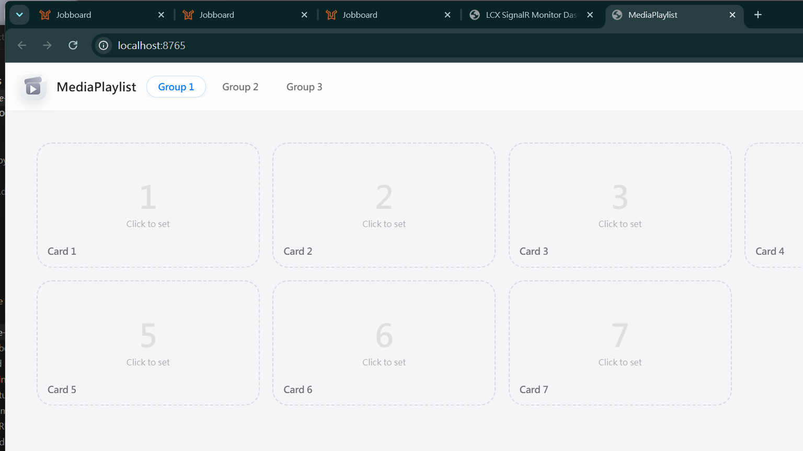
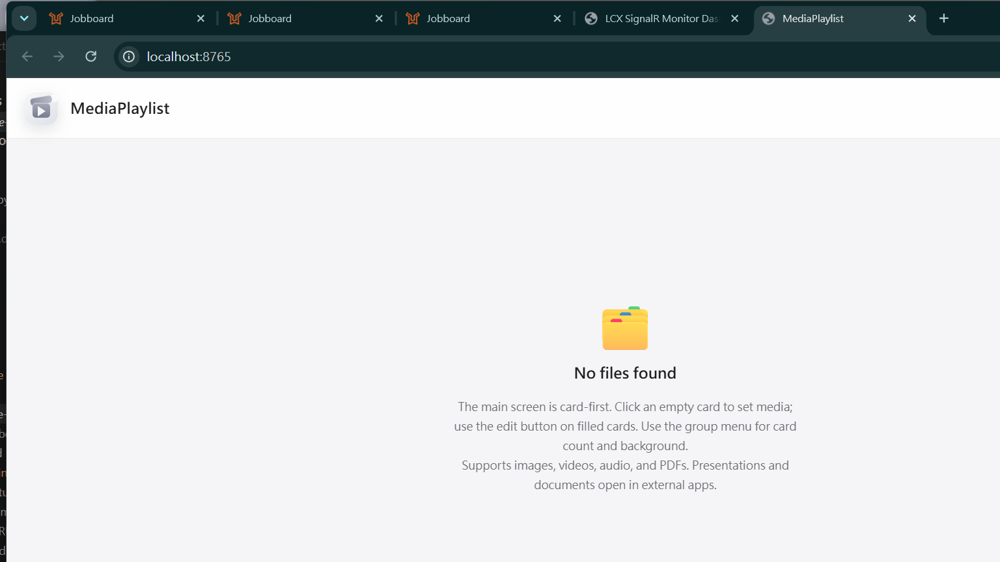

# MediaPlaylist

**[English](#english) | [中文](#中文)**

---

## English

MediaPlaylist is a single-file local media launcher with a card-based playlist UI. It runs a small HTTP server on your machine and opens in any browser — no installation required beyond Python.

### Screenshots

**Card mode** — groups in the top bar, each card holds one media file



**First run** — no folder added yet; the app guides you to the next step



### What it does

You create **groups** of **cards**. Each card holds one media file: a video, audio track, image, PDF, or document. Click a card to play it. Drag a file from your file manager onto a card to assign it instantly.

Everything stays on your local machine. No accounts, no cloud, no internet connection required.

### Features

- Card-based playlist UI with multiple groups
- Drag files directly onto cards to assign them
- In-browser playback for video, audio, images, and PDF
- External open for PowerPoint, Word, Excel, and other documents
- Custom thumbnails with 9-point focus control
- Group management: add, rename, multi-delete
- Background image per group
- Media browser with search, type filter, and folder scanning
- Task playlist sidebar for sequential playback
- Thumbnail auto-generation for videos (requires ffmpeg)
- All settings stored locally in JSON

### Requirements

- Python 3.8 or later
- No additional packages required for basic use
- Optional: `ffmpeg` on PATH (or placed in `tools/ffmpeg.exe`) for video thumbnail generation
- Optional: `pillow` and `pymupdf` for richer image and PDF thumbnail generation

### Installation

Clone or download the repository, then run:

```bash
git clone https://github.com/chingfonlee/mediaplaylist.git
cd mediaplaylist
python MediaPlaylist.py
```

The browser opens automatically at `http://localhost:8765`.

No virtual environment or `pip install` is needed for basic use. If you want richer thumbnails, install the optional packages:

```bash
pip install pillow pymupdf
```

### First use

1. The app opens in **Card mode** by default. Click **✏** on any card to assign a file.
2. To browse your media library first, click the **MediaPlaylist** logo to toggle back to the browser view, then click **Add folder** to scan a folder.
3. Drag any file from the browser panel onto a card to assign it.
4. Click a card to play.

### Configuration

Settings are saved automatically to `config.json` in the same folder (development mode) or `%APPDATA%\MediaPlaylist\` (when packaged as an exe). No manual editing is needed.

---

## 中文

MediaPlaylist 是一個單檔本地媒體播放器，採用卡片式播放清單介面。它在你的電腦上啟動一個小型 HTTP 伺服器，用任何瀏覽器開啟即可使用，除了 Python 之外不需要安裝任何東西。

### 截圖

**卡片模式** — 群組顯示在頂欄，每張卡片對應一個媒體檔案


**第一次啟動** — 尚未新增資料夾時的引導畫面


### 這個程式做什麼

你可以建立多個**群組**，每個群組裡有若干**卡片**，每張卡片對應一個媒體檔案：影片、音訊、圖片、PDF 或文件。點擊卡片即可播放，也可以直接從檔案總管把檔案拖曳到卡片上快速指定。

所有資料都儲存在你的本機，不需要帳號、不需要網路、不傳送任何資料到雲端。

### 功能

- 卡片式播放清單介面，支援多群組
- 從檔案總管直接拖曳檔案到卡片上指定媒體
- 瀏覽器內播放影片、音訊、圖片與 PDF
- PowerPoint、Word、Excel 等文件以外部程式開啟
- 自訂縮圖，支援 9 點焦點位置控制
- 群組管理：新增、改名、批次刪除
- 每個群組可設定獨立背景圖
- 媒體瀏覽器含搜尋、類型篩選與資料夾掃描
- 任務播放清單側欄，支援循序播放
- 影片縮圖自動生成（需要 ffmpeg）
- 所有設定以 JSON 格式儲存於本機

### 系統需求

- Python 3.8 以上
- 基本功能不需要額外套件
- 選用：`ffmpeg`（放在 PATH 或 `tools/ffmpeg.exe`）用於影片縮圖生成
- 選用：`pillow` 與 `pymupdf` 用於更豐富的圖片與 PDF 縮圖

### 安裝方式

下載或 clone 此 repo，然後執行：

```bash
git clone https://github.com/chingfonlee/mediaplaylist.git
cd mediaplaylist
python MediaPlaylist.py
```

程式啟動後會自動在瀏覽器開啟 `http://localhost:8765`。

基本使用不需要 virtual environment 或 `pip install`。若需要更豐富的縮圖功能，可安裝選用套件：

```bash
pip install pillow pymupdf
```

### 第一次使用

1. 程式預設以**卡片模式**開啟。點擊任一卡片上的 **✏** 即可指定媒體檔案。
2. 若想先瀏覽媒體庫，點擊頂欄 **MediaPlaylist** 標誌切換到瀏覽器模式，再點**新增資料夾**掃描你的資料夾。
3. 從瀏覽器面板把檔案拖到卡片上，或點擊 ✏ 手動選擇。
4. 點擊卡片即可播放。

### 設定儲存位置

設定會自動儲存：
- 開發模式（直接執行 .py）：與 `MediaPlaylist.py` 同一資料夾的 `config.json`
- 打包成 exe 後：`%APPDATA%\MediaPlaylist\config.json`

不需要手動編輯設定檔。

---

## License

MIT License — see [LICENSE](LICENSE) for details.
